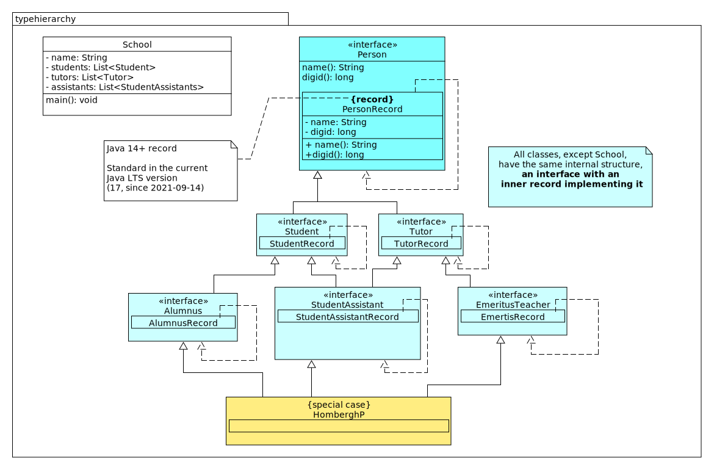

= On the Java Record
:author: Pieter van den Hombergh
include::commonhead.adoc[]

== First installment.

This project shows how you can build a typy hierarchy with Java  14+ `record` types.

* The Java record is a final immutable class with
** final means it can't be extended, so a type-hierarchy seems impossible.
* However a record can implement interfaces.
* and interfaces can [black]`extend` other interfaces, even more than classes can.
* and since an [blue]`interface` can have a [black]`static` inner classes

it is quite simple to do, giving all benefits of the record type and a proper hierarchy.

The trick is to give each (relevant) interface an static inner class of the record type, you are done.

.Java type hierarchy

.The client program
[source,java]
----
include::typeheirarchy/src/main/java/typeheirarchy/School.java[]
----

.Student Assistant
[source,java]
----
include::typeheirarchy/src/main/java/typeheirarchy/StudentAssistant.java[lines=22..40]
----

'''
